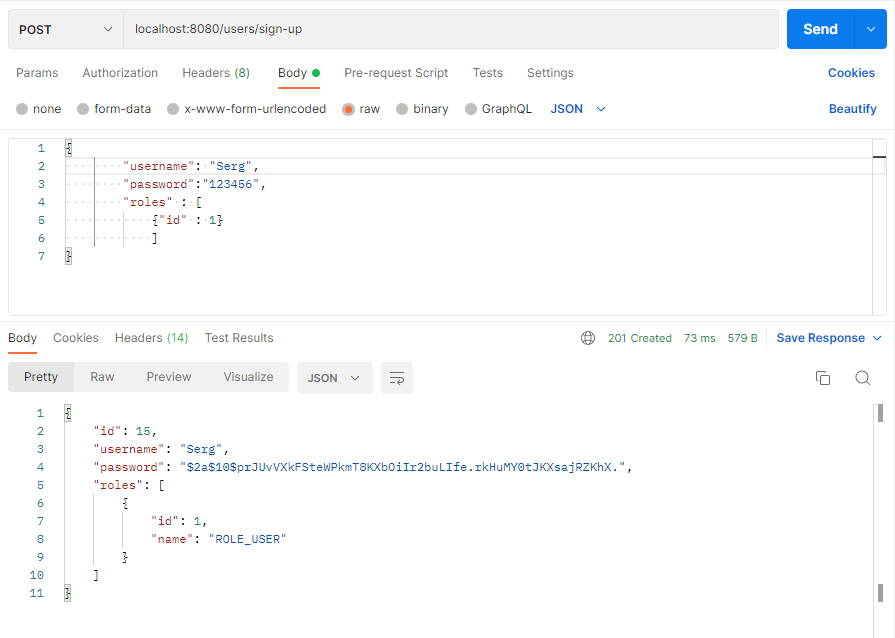
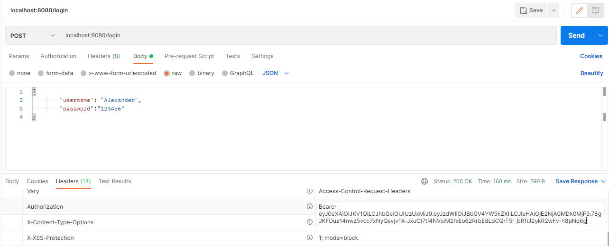
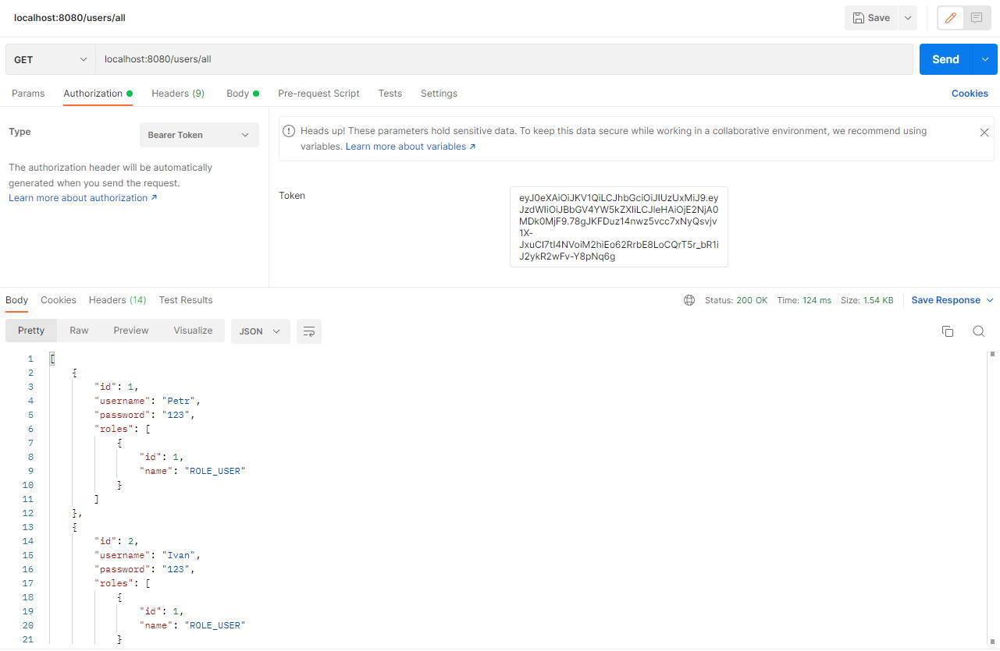
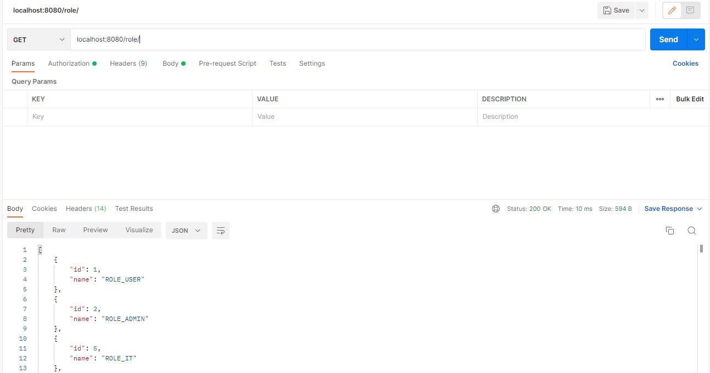
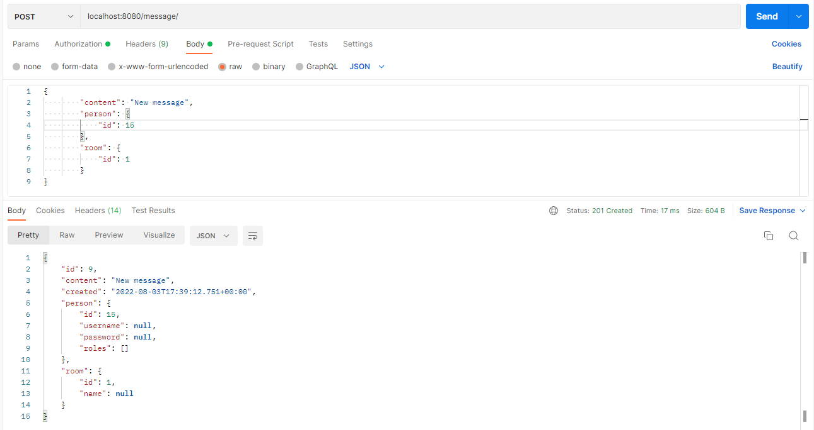
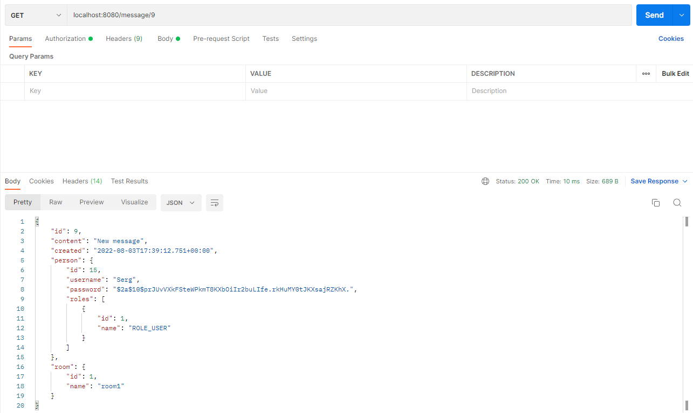

# Chat

# **Приложение - Чат** 

## 
Оглавление

<ul>
<li><a href="#01">Описание проекта</a></li>
<li><a href="#02">Стек технологий</a></li>
<li><a href="#03">Требования к окружению</a></li>
<li><a href="#04">Сборка и запуск проекта</a>
    <ol type="1">
        <li><a href="#0401">Сборка проекта</a></li>
        <li><a href="#0402">Запуск проекта</a></li>
    </ol>
</li>
<li><a href="#05">Взаимодействие с приложением</a>
    <ol  type="1">
        <li><a href="#0501">Создание учетной записи</a></li>
        <li><a href="#0502">Получение JWT токена</a></li>
        <li><a href="#0503">Получение списка всех пользователей</a></li>
        <li><a href="#0504">Получение списка всех ролей</a></li>
        <li><a href="#0505">Получение списка всех сообщений</a></li>
        <li><a href="#0506">Добавление сообщения</a></li>
        <li><a href="#0507">Получение сообщения по id</a></li>
    </ol>
</li>
<li><a href="#contacts">Контакты</a></li>
</ul>

## 
Описание проекта

Spring Boot приложение с демонстрацией работы Rest сервиса, реализующее функционал простого чата.

Функционал:

* Создание пользователей/сообщений/ролей/комнат.
* Получение списка пользователей/сообщений/ролей/комнат.
* Получение пользователя/сообщения/роли/комнаты по id.
* Редактирование пользователя/сообщения/роли/комнаты.
* Удаление пользователей/сообщений/ролей/комнат.

<a href="#contents">К оглавлению</a>

## 
Стек технологий

- Java 14
- Spring Boot 2.7, Spring Security, Spring Validation
- PosgreSQL 14, Spring Data
- JUnit 5, Mockito
- Maven 3.8

<a href="#contents">К оглавлению</a>

# Применяемые инструменты:

- Javadoc, JaCoCo, Checkstyle

<a href="#contents">К оглавлению</a>

## 
Требования к окружению

- Java 14, Maven 3.8, PostgreSQL 14

<a href="#contents">К оглавлению</a>

## 
Сборка и запуск проекта

Для выполнения действий данного раздела необходимо установить
и настроить систему сборки проектов Maven.

По умолчании проект компилируется и собирается в директорию target.

<a href="#contents">К оглавлению</a>

### 
1. Сборка проекта

Команда для сборки в jar.
`mvn clean package -DskipTests`

<a href="#contents">К оглавлению</a>

### 
2. Запуск проекта

Перед запуском проекта необходимо создать базу данных chat
в PostgreSQL, команда для создания базы данных:
`create database chat;`
Средство миграции Liquibase автоматически создаст структуру
базы данных и наполнит ее предустановленными данными.
Команда для запуска приложения:
`mvn spring-boot:run`

<a href="#contents">К оглавлению</a>

## 
Взаимодействие с приложением

Взаимодействие демонстрируется с помощью приложения Postman.

<a href="#contents">К оглавлению</a>

### 
1. Создание учетной записи

* `POST/users/sign-up`

<a href="#contents">К оглавлению</a>

### 
2. Получение JWT токена

* `POST/login`

В теле запроса необходимо указать полученного пользователя
из тела ответа при регистрации.
Полученный JWT необходимо добавить в разделе Authorization.
Далее JWT используется для получения доступа к сервису.

<a href="#contents">К оглавлению</a>

### 
3. Получение списка всех пользователей

* `GET/users/all`

<a href="#contents">К оглавлению</a>

### 
4. Получение списка всех ролей

* `GET/role/`

<a href="#contents">К оглавлению</a>

### 
5. Получение списка всех сообщений

* `GET/message/`

<a href="#contents">К оглавлению</a>

### 
6. Добавление сообщения

* `POST/message/`

<a href="#contents">К оглавлению</a>

### 
7. Получение сообщения по id

* `GET/message/id`

<a href="#contents">К оглавлению</a>

## 
Контакты

&nbsp;&nbsp;
&nbsp;&nbsp;

<a href="#contents">К оглавлению</a>
